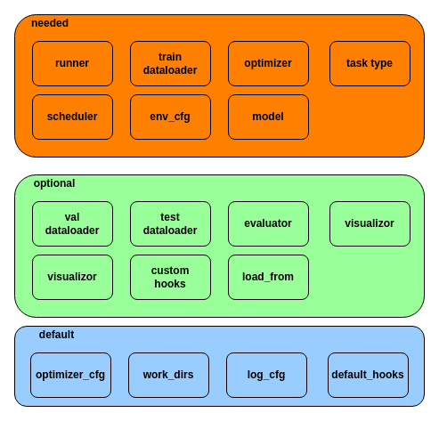

# **Config**

MMEngine 使用配置文件为训练过程的各个组件提供实例化参数，目前支持 .py，.json，.yaml格式的配置文件。

## **解析配置文件参数**

### **配置文件的字段类型**

程序运行时会使用 `Config.fromfile` 解析配置文件定义的字段。`.py` 格式的配置文件一般只含 python 的内置类型。其中 `dict` 在运行时会被解析成 `mmengine.ConfigDict` ，其余基础类型（str，list，tuple）保持类型不变 。对于含有 `type` 字段的 `dict` 可以使用 `build_from_cfg` 完成对象的实例化。

`config.py`：

```Python
test_int = 1
test_list = [1, 2, 3]
# include type, optimizer can be initiated by build_from_cfg
optimizer = dict(type='SGD', lr=0.1, momentum=0.9, weight_decay=0.0001)
```

`parse_config.py`：

```Python
from mmengine.registry import OPTIMIZER
from mmengine import build_from_cfg, Config


if __name__ == '__main__':
    cfg_path = '/path/to/config.py'
    cfg = Config.fromfile(cfg_path)
    test_int = cfg.test_int
    # test_int: 1
    test_list = cfg.test_list
    # test_list: [1, 2, 3]
    optimizer = build_from_cfg(cfg.optimizer, OPTIMIZER)
    # optimizer: torch.optim.SGD，cfg.optimizer: ConfigDict
```

### **解析预定义字段**

`Config` 还能解析预定义的字段，目前支持以下四种（变量名引用自[VS Code](https://code.visualstudio.com/docs/editor/variables-reference)）：

`{{ fileDirname }}` - 当前打开文件的目录名，例如 /home/your-username/your-project/folder

`{{ fileBasename }}` - 当前打开文件的文件名，例如 file.ext

`{{ fileBasenameNoExtension }}` - 当前打开文件不包含扩展名的文件名，例如 file

`{{ fileExtname }}` - 当前打开文件的扩展名，例如 .py

示例如下：

`config_predefined_var.py`：

```Python
a = 1
b = './work_dir/{{ fileBasenameNoExtension }}'
c = '{{ fileExtname }}'
```

`parse_config.py`：

```Python
cfg = Config.fromfile('./config_a.py')
# dict(a=1, b='./work_dir/config_a', c='.py')
```

### **解析外部模块**

如果需要批量导入系统环境变量或者注册自定义模块，可以将需要导入的模块写入配置文件的 `custom_imports` 。`Config` 会在解析阶段导入 `custom_imports` 中定义的模块。

`config_custom_module.py`：

```Python
custom_imports = dict(imports=['path.to.module.my_module'], allow_failed_imports=False)
```

`my_module.py`：

```python
from mmcv.cnn import CONV_LAYERS
import os

os.environ["TEST_VALUE"] = 'test'
@CONV_LAYERS.register_module()
class NewConv1:
    pass

@CONV_LAYERS.register_module()
class NewConv2:
    pass

```

`parse_cfg.py`：

```Python
cfg = Config.fromfile('/path/to/config_custom_module.py', import_custom_modules=True)
assert os.environ["TEST_VALUE"] == 'test' 
assert 'NewConv1' in CONV_LAYERS.module_dict
assert 'NewConv2' in CONV_LAYERS.module_dict
```

使用 `custom_imports` 能够非侵入式导入自定义注册模块。

### **继承式的配置文件**

下游 codebase 一般会有通用配置文件，如 `default_runtime.py`，`default_schedule.py`。继承各种类型的通用配置可以减少具体任务的配置流程。以 `optimizer_cfg.py` 为例：

`optimizer_cfg.py`：

```Python
optimizer = dict(type='SGD', lr=0.02, momentum=0.9, weight_decay=0.0001)
optimizer_config = dict(grad_clip=None)
max_epoch = 12
gpu_ids = [0, 1]
```

- **字段完全继承**

具体任务的配置文件不定义字段，直接继承 `default_runtime_cfg` 中的参数：

`task_config.py`：

```Python
_base_ = ['path/to/default_runtime_cfg.py'] 
```

- **修改字段**

有时候需要修改继承过来字段的值，对于 `int`、`list` 类型的字段，配置文件重新定义变量就能完成覆盖。对于 `dict` 类型的字段，完全覆盖需要加上 `_delete_` 关键字。

`task_config.py`：

```python
_base_ = ['path/to/default_runtime_cfg.py']
optimizer = dict(type='SGD', lr=0.1)
max_epoch = 24
gpus_ids = [0]
optimizer_config = dict(
    _delete_=True, grad_clip=dict(max_norm=35, norm_type=2))
```

- **使用 base 文件中定义的变量**

有时需要重复利用 `_base_` 中定义的字段，可以通过 `{{}}` 获取来获取对应变量的拷贝。

`task_config.py`：

```python
_base_ = ['path/to/default_runtime_cfg.py']
a = {{_base_.optimizer}}
# Equivalent to： a = dict(type='SGD', lr=0.1)
```

\```{tip} `_base_` 的各个文件不能定义重名变量 ```

### **json、yaml配置文件示例**

`optimizer_cfg.yaml`：

```YAML
checkpoint_config:
  interval: 1
env_cfg:
  backend: nccl
load_from: null
log_config:
  hooks:
  - type: TextLoggerHook
  interval: 100
log_level: INFO
optimizer:
  lr: 0.02
  momentum: 0.9
  type: SGD
  weight_decay: 0.0001
optimizer_config:
  grad_clip: null
```

`optimizer_cfg.json`：

```JSON
{
  "checkpoint_config": {
    "interval": 1
  },
  "log_config": {
    "interval": 100,
    "hooks": [
      {
        "type": "TextLoggerHook"
      }
    ]
  },
  "optimizer": {
    "type": "SGD",
    "lr": 0.02,
    "momentum": 0.9,
    "weight_decay": 0.0001
  },
  "optimizer_config": {
    "grad_clip": null
  },
  "env_cfg": {
    "backend": "nccl"
  },
  "log_level": "INFO",
  "load_from": null
}
```

## **构建最简 runner**

以 .py 格式的配置文件为例，要想基于 MMEngine 构建最简训练流程，需要给 `runner` 配置最低限度的参数，包括 `model` 、`optimzer`、`runner`、`env_cfg`、`scheduler` 和 `train_dataloader`，示例如下：

```Python
model = dict(type='custom_model')

# default EpochBasedRunner
max_epoch = 12
# config optimizer
optimizer = dict(type='SGD', lr=0.1, momentum=0.9, weight_decay=0.0001)
# config dataloader
# Transform pipeline
train_transforms = [dict(type=...), dict(type=...)]
# training dataset
train_dataset = dict(type=..., transforms=train_transforms)
train_dataloader = dict(dataset=train_dataset,
                        batch_size=8)
scheduler = dict(type=...)
env_cfg = dict(backend='nccl')
```

其余组件，例如 `val_dataloader` 、`evaluator` 等为可选配置组件（允许训练阶段不起作用）。`optimizer_cfg`、`log_cfg`为默认配置组件（初始化阶段默认构造，无需配置，训练阶段起作用）。按照 配置文件的一级字段划分，总结如下：



每个模块的配置方法可见具体模块的用户文档。

