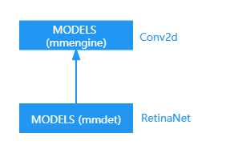
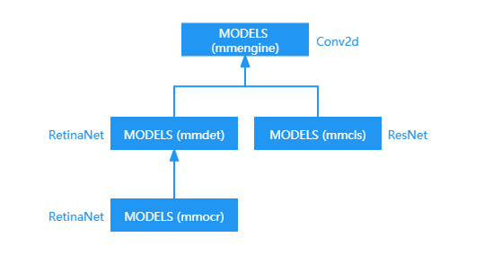

# 注册器（Registry）

OpenMMLab 的算法库支持了丰富的算法和数据集，因此实现了很多功能相近的模块。例如 ResNet 和 SE-ResNet 的算法实现分别基于 `ResNet` 和 `SEResNet` 类，这些类有相似的功能和接口，都属于 model。
为了管理这些功能相似的模块，MMEngine 实现了 [注册器](https://mmengine.readthedocs.io/zh_CN/latest/api.html#mmengine.registry.Registry)。
OpenMMLab 大多数算法库均使用注册器来管理他们的代码模块，包括 [MMDetection](https://github.com/open-mmlab/mmdetection)， [MMDetection3D](https://github.com/open-mmlab/mmdetection3d)，[MMClassification](https://github.com/open-mmlab/mmclassification)，和 [MMEditing](https://github.com/open-mmlab/mmediting) 等。

## 什么是注册器

MMEngine 实现的注册器可以看作一个映射表和模块构建方法（build function）的组合。映射表维护了一个字符串到类的映射，使得用户可以借助字符串查找到相应的类。
而模块构建方法则定义了如何根据字符串查找到对应的类，并定义了如何实例化这个类。MMEngine 中的注册器默认使用 [build_from_cfg 函数](https://mmengine.readthedocs.io/zh_CN/latest/api.html#mmengine.registry.build_from_cfg) 来查找并实例化字符串对应的类。

一个注册器中管理的类通常有相似的接口和功能，因此该注册器可以被视作这些类的抽象。例如注册器 `Classifier` 可以被视作所有分类网络的抽象，管理了  `ResNet`， `SEResNet`，和 `RegNetX` 等分类网络的类。
使用注册器管理功能相似的模块可以显著提高代码的扩展性和灵活性。用户可以跳至最后一个章节了解`为什么使用注册器`。

## 入门用法

使用注册器管理代码库中的模块，需要以下三个步骤。

1. 创建注册器
2. 创建一个用于实例化类的构建方法（可选，在大多数情况下您可以只使用默认方法）
3. 将模块加入注册器中

假设我们要实现一系列数据集转换器（Dataset Converter），将不同格式的数据转换为标准数据格式。我们希望可以实现仅修改配置就能够使用不同的转换器而无需修改代码。

我们先创建一个名为 `converters` 的目录作为包，在包中我们创建一个文件来实现构建器（builder），

```python
# model/builder.py
from mmengine.registry import Registry
# 创建转换器的注册器
CONVERTERS = Registry('converter')
```

然后我们可以实现不同的转换器。

```python
# converters/converter.py
from .builder import CONVERTERS

# 使用注册器管理模块
@CONVERTERS.register_module()
class Converter1(object):
    def __init__(self, a, b):
        self.a = a
        self.b = b

@CONVERTERS.register_module()
class Converter2(object):
    def __init__(self, a, b, c):
        self.a = a
        self.b = b
        self.c = c
```

使用注册器管理模块的关键步骤是，将实现的模块注册到注册表 `CONVERTERS` 中。通过 `@CONVERTERS.register_module()` 装饰所实现的模块，字符串和类之间的映射就可以由 `CONVERTERS` 构建和维护，我们也可以通过 `CONVERTERS.register_module(module=Converter1)` 实现同样的功能。

通过注册，我们就可以通过 `CONVERTERS` 建立字符串与类之间的映射，

```python
'Converter1' -> <class 'Converter1'>
```

```{note}
只有模块所在的文件被导入时，注册机制才会被触发，所以我们需要在某处导入该文件。
```

模块成功注册后，我们可以通过配置文件使用这个转换器。

```python
# main.py
# 注意，converter_cfg 可以通过解析配置文件得到
converter_cfg = dict(type='Converter1', a=a_value, b=b_value)
converter = CONVERTERS.build(converter_cfg)
```

如果我们想使用 `Converter2`，仅需修改配置。

```python
converter_cfg = dict(type='Converter2', a=a_value, b=b_value, c=c_value)
converter = CONVERTERS.build(converter_cfg)
```

假如我们想在创建实例前检查输入参数的类型（或者任何其他操作），我们可以实现一个构建方法并将其传递给注册器从而实现自定义构建流程。

```python
from mmengine.registry import Registry

# 创建一个构建方法
def build_converter(cfg, registry, *args, **kwargs):
    cfg_ = cfg.copy()
    converter_type = cfg_.pop('type')
    if converter_type not in registry:
        raise KeyError(f'Unrecognized converter type {converter_type}')
    else:
        converter_cls = registry.get(converter_type)

    converter = converter_cls(*args, **kwargs, **cfg_)
    return converter

# 创建一个用于转换器的注册器，并将 `build_converter` 传递给 `build_func` 参数
CONVERTERS = Registry('converter', build_func=build_converter)
```

```{note}
在这个例子中，我们演示了如何使用参数：`build_func` 自定义构建类的实例的方法。
该功能类似于默认的 `build_from_cfg` 方法。在大多数情况下，使用默认的方法就可以了。
```

## 使用注册器提高代码的扩展性

使用注册器管理功能相似的模块可以便利模块的灵活拓展与自由组合。下面通过例子介绍注册器的两个优点。

### 模块的自由组合

假设用户实现了一个模块 `ConvBlock`，`ConvBlock` 中定义了一个卷积层和一个激活层。

```python
# train.py
import torch.nn as nn

class ConvBlock(nn.Module):

    def __init__(self):
        self.conv = nn.Conv2d()
        self.act = nn.ReLU()

    def forward(self, x):
        x = self.conv(x)
        x = self.act(x)
        return x


conv_blcok = ConvBlock()
```

可以发现，此时 ConvBlock 只支持 `nn.Conv2d` 和 `nn.ReLU` 的组合。如过我们想要让 `ConvBlock` 更加通用，例如让它可以使用其他类型的卷积层或者激活层，在不使用注册器的情况下，需要进行如下改动

```python
# train.py
import torch.nn as nn

class ConvBlock(nn.Module):

    def __init__(self, act_type):
        self.conv = nn.Conv2d()
        if act_type = 'relu':
            self.act = nn.ReLU()
        elif act_type = 'gelu:
            self.act = nn.GELU()

    def forward(self, x):
        x = self.conv(x)
        x = self.act(x)
        return x


conv_blcok = ConvBlock()
```

可以发现，上述改动需要枚举模块的各种类型，无法灵活地组合各种模块。而如果使用注册器，该问题可以轻松解决，用户只需要在构建 ConvBlock 的时候设置不同的 `conv_cfg` 和 `act_cfg` 即可达到目的。

```python
import torch.nn as nn
from mmengine.registry import MODELS, ACTIVATION_LAYERS

# 将 conv 和 act 分别加入 MODELS 和 ACTIVATION_LAYERS 的注册器


class ConvBlock(nn.Module):

    def __init__(self, conv_cfg, act_cfg):
        self.conv = MODELS.build(conv_cfg)
        self.pool = ACTIVATION_LAYERS.build(act_cfg)

    def forward(self, x):
        x = self.conv(x)
        x = self.act(x)
        return x

# 注意，conv_cfg 和 pool_cfg 可以通过解析配置文件得到
conv_cfg = dict(type='DeformConv2d')
act_cfg = dict(type='ReLU')
conv_block = ConvBlock(conv_cfg, act_cfg)
```

### 模块的灵活拓展

假设实现了一个卷积模块 `Con2d`，

```python
# model/conv.py
import torch.nn as nn

class Conv2d(nn.Module):
    pass
```

我们想在训练中使用该模块，可以在 `train.py` 中导入该模块。

```python
# train.py
from .model import Conv2d

conv = Conv2d()
```

这样看似没有什么问题，但假如添加了新模块 `DeformConv2d`，

```python
# model/conv.py
import torch.nn as nn

class Conv2d(nn.Module):
    pass

class DeformConv2d(nn.Module):
    pass
```

如果需要使用 `DeformConv2d`，就需要修改 `train.py` 。

```python
# train.py
from .model import Conv2d, DeformConv2d

conv = DeformConv2d()
```

而如果使用注册器，则可以避免 `train.py` 文件的改动。

```python
# model/conv.py
from mmengine.registry import Registry, MODELS

import torch.nn as nn

@MODELS.register_module()
class Conv2d(nn.Module):
    pass

@MODELS.register_module()
class DeformConv2d(nn.Module):
    pass
```

```python
# train.py
from mmengine.registry import MODELS

cfg = dict(type='Conv2d')  # 注意，这个配置可以通过解析配置文件得到
conv = MODELS.build(cfg)
```

## 通过 Registry 实现模块的跨库调用

MMEngine 的注册器支持跨项目调用，即可以在一个项目中使用另一个项目的模块。虽然跨项目调用也有其他方法的可以实现，但 MMEngine 注册器提供了更为简便的方法。

为了方便跨库调用，MMEngine 提供了 12 个根注册器：

- RUNNERS: Runner 相关的注册器，如 `EpochBasedRunner`, `IterBasedRunner`
- RUNNER_CONSTRUCTORS: Runner 的构造器
- HOOKS: 钩子，如 `CheckpointHook`, `ProfilerHook`
- DATASETS: 数据集
- SAMPLERS: `Dataloader` 的 `sampler`，用于采样数据
- PIPELINES: 各种数据预处理，如 `Resize`, `Reshape`
- MODELS: 模型的各种模块
- WEIGHT_INITIALIZERS: 权重初始化的工具
- OPTIMIZERS: 注册了 PyTorch 中所有的 `optimizer` 以及自定义的 `optimizer`
- OPTIMIZER_CONSTRUCTORS: optimizer 的构造器
- TASK_UTILS: 任务强相关的一些组件，如 `AnchorGenerator`, `BboxCoder`

下面我们以 OpenMMLab 开源项目为例介绍如何跨项目调用模块。

### 调用父节点的模块

`MMEngine` 中定义了模块 `Conv2d`，

```python
from mmengine.registry import Registry, MODELS

MODELS.register_module()
class Conv2d(nn.Module):
    pass
```

`MMDetection` 中定义了模块 `RetinaNet`，

```python
from mmengine.registry import Registry, MODELS as MMENGINE_MODELS
# parent 参数表示当前节点的父节点，通过 parent 参数实现层级结构
# scope 参数可以理解为当前节点的标志。如果不传入该参数，则 scope 被推导为当前文件所在
# 包的包名，这里为 mmdet
MODELS = Registry('model', parent=MMENGINE_MODELS, scope='mmdet')

@MMDET_MODELS.register_module()
class RetinaNet(nn.Module):
    pass
```

下图是 `MMEngine`, `MMDetection` 两个项目的注册器层级结构。



我们可以在 `MMDetection` 中调用 `MMEngine` 中模块。

```python
from mmdet.models import MODELS
# 创建 RetinaNet 实例
model = MODELS.build(cfg=dict(type='RetinaNet'))
# 也可以加 mmdet 前缀
model = MODELS.build(cfg=dict(type='mmdet.RetinaNet'))
# 创建 ResNet 实例
model = MODELS.build(cfg=dict(type='mmengine.ResNet'))
# 也可以不加 mmengine 前缀
model = MODELS.build(cfg=dict(type='ResNet'))
```

需要注意的是，如果不加前缀，`build` 方法首先查找当前节点是否存在该模块，如果存在则返回该模块，否则会继续向上查找父节点甚至祖先节点直到找到该模块。因此，如果当前节点和父节点存在同一模块并且希望调用父节点的模块，我们需要指定 `scope` 前缀。

### 调用兄弟节点的模块

除了可以调用父节点的模块，也可以调用兄弟节点的模块。

`MMClassification` 中定义了模块 `ResNet`，

```python
from mmengine.registry import Registry, MODELS
MODELS = Registry('model', parent=MMENGINE_MODELS)

@MODELS.register_module()
class ResNet(nn.Module):
    pass
```

下图是 `MMEngine`, `MMDetection`, `MMClassification` 三个项目的注册器层级结构。


我们可以在 `MMDetection` 中调用 `MMClassification` 定义的模块，

```python
from mmdet.models import MODELS
model = MODELS.build(cfg=dict(type='mmcls.ResNet'))
```

也可以在 `MMClassification` 中调用 `MMDetection` 定义的模块。

```python
from mmcls.models import MODELS
model = MODELS.build(cfg=dict(type='mmdet.RetinaNet'))
```

调用兄弟节点的模块需要指定在 `type` 中指定 `scope` 前缀，如果不想指定，我们可以将 `build` 方法中的 `default_scope` 参数设置为 'mmdet'，它会将 `default_scope` 对应的 `registry` 作为当前 `Registry` 并调用 `build` 方法。

```python
from mmcls.models import MODELS
model = MODELS.build(cfg=dict(type='RetinaNet'), default_scope='mmdet')
```

注册器除了支持两层结构，三层甚至更多层结构也是支持的。

例如 `MMOCR` 会 `MMDetection`

`MMClassification` 中定义了模块 `ResNet`，

```python
from mmengine.model import Registry
from mmdet.model import MODELS as MMDET_MODELS
MODELS = Registry('model', parent=MMDET_MODELS)

@MODELS.register_module()
class FCNet(nn.Module):
    pass
```

下图是 `MMEngine`, `MMDetection`, `MMClassification`, `MMOCR` 四个项目的注册器层级结构。



我们可以在 `MMOCR` 中调用 `MMDetection` 或者 `MMOCR` 中的模块，

```python
from mmocr.model import MODELS
# 也可以不提供 mmdet 前缀，如果在 MMOCR 找不到则会向上在 MMDet 中查找
model = MODELS.build(cfg=dict(type='mmdet.RetinaNet'))
# 调用兄弟节点的模块需提供 mmcls 前缀，也可以设置 default_scope 参数
model = MODELS.build(cfg=dict(type='mmcls.ResNet'))
```

也可以在 `MMClassification` 中调用 `MMOCR` 的模块。

```python
from mmcls.models import MODELS
# 需要注意前缀的顺序，'mmocr.mmdet.ResNet' 是不正确的
model = MODELS.build(cfg=dict(type='mmdet.mmocr.FCNet'))
# 当然，更简单的方法是直接设置 default_scope
model = MODELS.build(cfg=dict(type='FCNet', default_scope='mmocr'))
```
