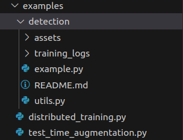
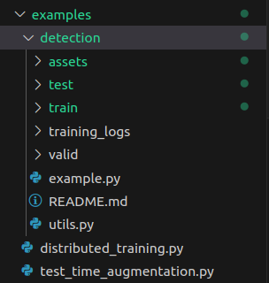
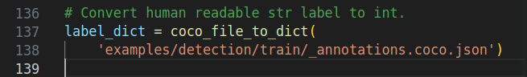
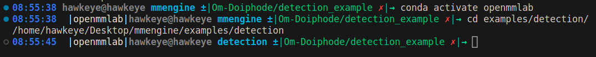
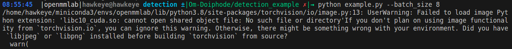

# Object Detection using Faster RCNN

This code implements object detection using the Faster R-CNN (Region-based Convolutional Neural Networks) algorithm. It trains a Faster R-CNN model on a custom dataset (<b>COCO128</b>) and evaluates its performance using the COCO evaluation metric.

## Prerequisites

- Python 3.6 or higher
- PyTorch 1.7 or higher
- torchvision
- mmeval

## Usage

### 1. Prepare your dataset

- Download the dataset from this link: [COCO 128 Dataset](https://universe.roboflow.com/ds/CX2WnbQHss?key=XcVwZuSu8R).
- Extract the downloaded zip folder.
- Copy the <b>train, test</b> and <b>valid</b> folders from the extracted folder.
- Paste the folders into the <b>examples/detection/</b> directory.

Before Extracting:

After extracting and copying files:

### 2. Update the code (Optional)

- Modify the <b>label_dict</b> variable to map your class labels to integer IDs.

- Adjust the model configuration and hyperparameters in the MMFasterRCNN and Runner classes, if needed. You can modify parameters like batch size, learning rate, number of epochs, etc.

### 3. Run the code

1. Move into the <b>detection</b> folder

2. Run the following command

`python example.py --batch_size 8`

## Customization

- To use a different pre-trained backbone network, modify the MMFasterRCNN class and replace the <b>fasterrcnn_resnet50_fpn</b> model with your desired backbone.
- Adjust the training and validation settings in the Runner class, such as batch size, learning rate, number of epochs, etc., according to your specific requirements.

## Output

- During training, the code will save the model checkpoints, logs, and other training-related information in the <b>work_dir</b> directory.
- After training, the code will evaluate the model using the COCO evaluation metric and display the results, including metrics like mAP (mean Average Precision), recall, precision, etc.
